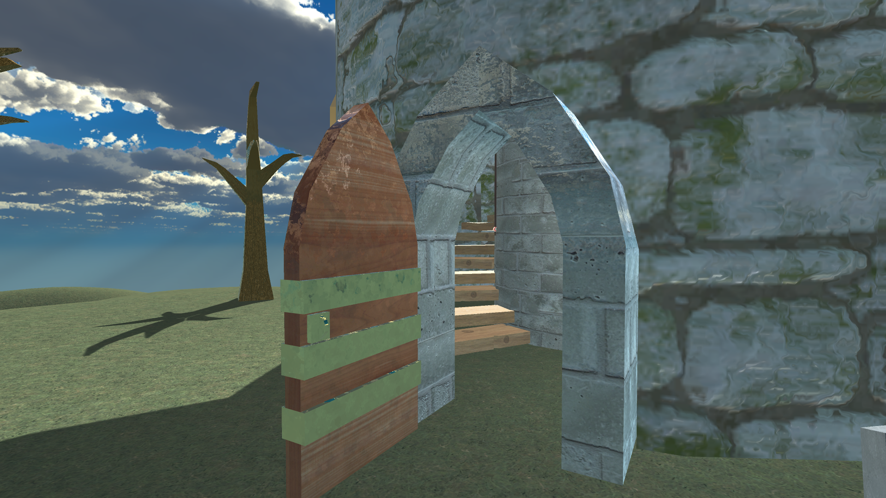

# 3d Animation and Asset Production Final Project

[Final Build in Google Drive](https://drive.google.com/drive/folders/1pw62D78qRddJl0U0c7YGul8KDx0Pht3e?usp=sharing)

This is an environment that I created in Unity, with models I made in Maya and textures from Adobe Substance Painter. The environment is a large wizard tower with an animated door and chair upstairs. 

